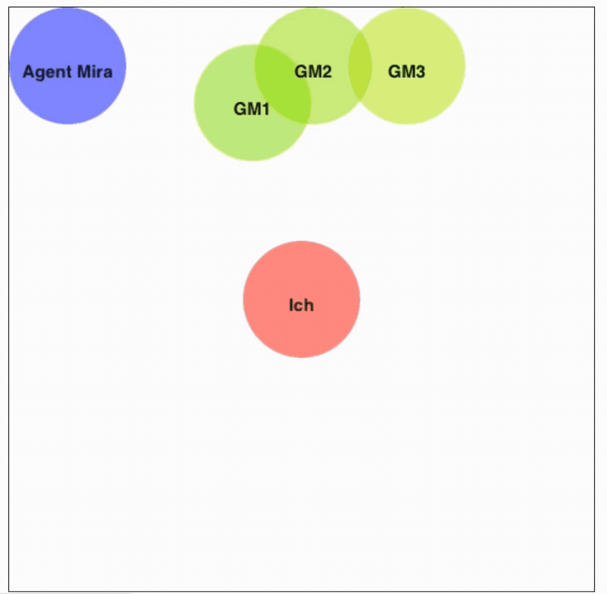

# Group Perception Canvas – Subjective Bonding Toolkit

This open-source tool allows researchers to measure **subjective social closeness (bonding)** in group-agent interactions using an intuitive drag-and-drop interface. Participants can arrange circles representing themselves, the agent, and other group members to indicate how close they felt during an interaction.

Developed and field-tested in a large-scale in-the-wild study at a museum this toolkit is lightweight, customizable, and easily embedded into survey platforms such as SoSci Survey (Germany) [https://www.soscisurvey.de].

## 🖱 Demo

Here's how the Group Perception Canvas works in practice (Ich = Participent "Me"; Agent Mira = Agent; GM# - adaptable for group members)

## 🔍 Background & Motivation

While many tools in Human-Agent Interaction research focus on physical proximity or objective metrics, subjective social closeness remains underrepresented — especially in **group contexts**. Inspired by the  Interactive IOS (Inclusion of Other in the Self) Scale for Multiparty Interactions (IIMI) [1,2], the **Group Perception Canvas** allows participants to **visually indicate their felt closeness** to socially interactive agents (SIAs) and peers.

This canvas was developed as part of a doctoral research project investigating bonding in group-agent interactions (GAI) and was deployed in tablet-based surveys after museum interactions with a robot and a virtual agent.

## 🛠 Features

- 🧑‍🤝‍🧑 **Visual bonding representation** via drag-and-drop circle placement
- 🔄 **Dynamic labeling** (e.g., Me, Agent, GM1, GM2…) to reflect group structure
- 📱 **Embeddable into survey tools** like SoSci Survey or used standalone
- 📊 **Exports as image and distance extraction** for post-hoc distance calculation (optional)
- 🧩 **Fully customizable** layout and radius per study needs
- ✅ **Field-tested** with 180+ participants

## 📁 Files

- `index.html`: Main HTML structure
- `style.css`: Styling and layout
- `script.js`: Drag-and-drop logic and export functionality

 ## 📊 Distance Extraction (Optional)

If the exported PNG images from the canvas are to be analyzed quantitatively, the toolkit includes a Python script for **automatic image-based distance calculation**. It:

- Detects circles by color (Red, Blue, Green)
- Calculates pairwise distances between labeled circles
- Converts pixel distances to **millimeters** using a scaling factor
- Saves results into a structured **Excel file**

📄 See: [`image-analysis/distance_analysis.py`](image-analysis/distance_analysis.py)

### 📦 Dependencies

pip install opencv-python numpy openpyxl

### 💡Note

This code illustrates an example interaction involving a participant (“Participant”), an agent (“Agent”), and two group members (“GM 1” and “GM 2”). The number and labeling of group members are not fixed but are determined adaptively based on filter questions in the associated questionnaire (see e.g., https://github.com/anammueller/questionnaire-transcripst-Skilled/blob/main/Transkript%20des%20Fragebogens%20zur%20Studie%20im%20Deutschen%20Museum%20Bonn%20mit%20dem%20MetaHuman.pdf). These filters were configured such that the code adjusts dynamically: “Participant” and “Agent” are always displayed (reflecting the core dyadic interaction), and the number of group members shown varies depending on participants’ responses.

### References

[1]  S. Sebo, A. Wuqi Zhang, and T.-H. Lin, “Interactive IOS Scale for Multiparty Interactions (IIMI): A Measure of Interpersonal Closeness with Multiple Interactants,” Sebo Lab. [Online]. Available: https://github.com/SeboLab/interactive_ios_scale

[2] A. W. Zhang, T.-H. Lin, X. Zhao, and S. Sebo, “Ice-Breaking Technology: Robots and Computers Can Foster Meaningful Connections between Strangers through In-Person Conversations,” in Proceedings of the 2023 CHI Conference on Human Factors in Computing Systems. ACM, 2023-04-19, pp. 1–14. [Online]. Available: https://dl.acm.org/doi/10.1145/3544548.3581135
  
## License

This project is licensed under the Creative Commons Attribution-NonCommercial 4.0 International License (CC BY-NC 4.0).  
You are free to share and adapt the material for non-commercial purposes with appropriate attribution.

More info: [https://creativecommons.org/licenses/by-nc/4.0/](https://creativecommons.org/licenses/by-nc/4.0/)

## Acknowledgments

This code was developed as part of Ana Müllers PhD program at at the Cologne Cobots Lab, TH Köln – University of Applied Sciences, Germany within the project “Skilled” [https://www.th-koeln.de/anlagen-energie-und-maschinensysteme/skilled_87008.php]. This research was funded by the Federal Ministry of Research, Technology and Space (formerly the Federal Ministry of Education and Research, Germany) in the framework FH-Kooperativ 2-2019 (project number 13FH504KX9). We thank our collaboration partners DB Systel GmbH. We would also like to thank our student assistant Alwaleed Altabaa for refining the code updates and providing valuable feedback during the development process.

